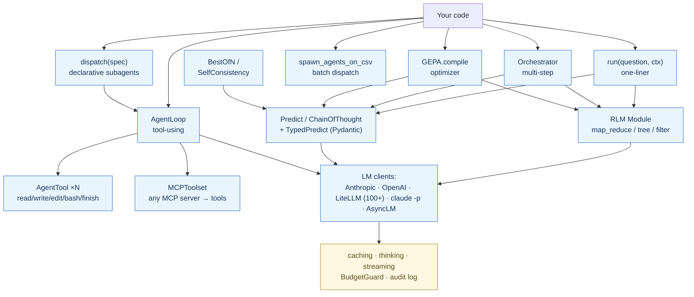

# harness-rlm

> A composable Python harness for long-context LLM applications. Recursive decomposition, reflective prompt optimization, tool-using agents, declarative subagents, and 100+ LLM providers — under one signature-typed API.

[](tests/) [](pyproject.toml) [](CHANGELOG.md) [](LICENSE)

---

## Three facts that motivate this repo

1. **Long context is a programming problem, not a model problem.** On BrowseComp-Plus (6–11M tokens), flat GPT-5 scores **0%**. The same GPT-5 wrapped in a Recursive Language Model with GPT-5-mini as sub-LM scores **91.33%** at $0.99/query ([Zhang et al., arXiv:2512.24601](https://arxiv.org/abs/2512.24601), Dec 2025). The capability is unlocked by *programmatic decomposition*, not bigger models.

2. **Prompts are programs that need an optimizer.** GEPA (Genetic-Evolutionary Pareto reflective Adaptation) beats GRPO by 6–20% with **35× fewer rollouts** ([Agrawal et al., arXiv:2507.19457](https://arxiv.org/abs/2507.19457), ICLR 2026 Oral). Per-example feedback drives prompt evolution — not scalar scores.

3. **Tool-using agents need 4 tools, not 40.** Pi-mono ships with read / write / edit / bash and nothing else — and it works ([Zechner, 2025](https://mariozechner.at/posts/2025-11-30-pi-coding-agent/)). Registries front-load token cost; CLI-as-tool patterns pay tokens only when invoked.

This repo gives you all three primitives, composable, in ~4.5K LOC, with 232 tests.

---

## TL;DR — what's in the box



| You want to | You use |
|---|---|
| Ask one question, get one answer | `Predict("q -> a")` |
| Answer a question over a long document | `RLM("q, doc -> a")` or just `run(q, ctx)` |
| Get a typed Pydantic instance back | `TypedPredict("q -> a", output_model=MyModel)` |
| Sample N times and majority-vote | `BestOfN(child, n=5)` / `SelfConsistency` |
| Optimize a prompt against a metric | `GEPA(metric).compile(student, trainset)` |
| Chain multiple modules with shared state | `Orchestrator([Step(...), Step(...)])` |
| Build a tool-using agent | `AgentLoop(tools=PI_CORE_TOOLS)` |
| Spawn a declarative subagent | `dispatch(spec, task)` from `~/.harness-rlm/agents/<name>.toml` |
| Run a Module over a CSV | `spawn_agents_on_csv(csv, module=..., output_csv=...)` |
| Use OpenAI / Bedrock / Vertex / Ollama | `LiteLLMLM(model="openai/gpt-5.2")` or `OpenAILM(...)` |
| Stream tokens to a terminal | `for evt in stream(lm, prompt): ...` |
| Cache the system prompt across calls | `LM(enable_caching=True)` |
| Get a Mermaid diagram of an execution | `trace_to_mermaid(pred.trace)` |
| Run inside `claude -p` (no API key) | `ClaudeCLILM(model="claude-haiku-4-5")` |
| Wrap an external MCP server | `MCPToolset(command="npx", args=[...])` |

---

## Why this repo exists

Most LLM harnesses pick one of these:

- A **prompt-engineering DSL** (LangChain, LlamaIndex, Semantic Kernel) — heavy abstractions, leaky in production.
- A **typed program-with-LLMs library** (DSPy, Pydantic AI, BAML) — typed, but no RLM, no agent loop primitives.
- A **tool-using agent harness** (Claude Code, Codex, OpenCode, Goose, Hermes) — great for coding, but not composable libraries.

`harness-rlm` is the first to bundle **all three layers** with a unified `Signature` / `Module` / `LM` API:

| Layer | Comparable to | This repo's module |
|---|---|---|
| Typed I/O contracts | DSPy `Signature` + `Module` | `signatures.py`, `modules.py` |
| Pydantic-validated outputs | Pydantic AI, OpenAI Structured Outputs | `structured.py` (`TypedPredict[T]`) |
| Long-context decomposition | DSPy `RLM`, custom REPL loops | `rlm.py` |
| Reflective prompt optimizer | DSPy `GEPA`, OptIMon | `gepa.py` |
| Ensemble / self-consistency | DSPy `BestOfN`, custom voting | `ensemble.py` |
| Tool-using agent loop | Pi-mono `agent-loop.ts`, OpenAI Agents SDK | `agent_loop.py`, `tools.py` |
| Declarative subagents | Codex `.codex/agents/*.toml` | `subagents.py` |
| CSV batch dispatch | Codex `spawn_agents_on_csv` | `batch.py` |
| Multi-step composition | LangGraph, CrewAI | `orchestrator.py` |
| Session memory | Hermes session DB | `orchestrator.SessionStore` |
| Multi-provider LMs | LiteLLM | `providers.py` (`OpenAILM`, `LiteLLMLM`) |
| Prompt caching | Anthropic native | `caching.py` |
| Extended thinking | Anthropic native, GPT-5 reasoning_effort | `LM(thinking_budget=N)` |
| Streaming | Anthropic / OpenAI native | `streaming.py` (`stream`, `AsyncLM`) |
| MCP-as-client | MCP SDK | `mcp_client.py` (`MCPToolset`) |
| Trace visualization | LangSmith / Helicone | `trace_viz.py` (`format_trace` + Mermaid) |

Plus four ready-made harness adapters (Claude Code / Goose / Codex / OpenCode) and one MCP server for sub-LLM dispatch when running inside an agentic harness.

---

## Install

### Path A — from source (uv, recommended)

```bash
git clone https://github.com/rachittshah/harness-rlm
cd harness-rlm
uv sync --extra dev
```

### Path B — pip / virtualenv

```bash
git clone https://github.com/rachittshah/harness-rlm
cd harness-rlm
python -m venv .venv && source .venv/bin/activate
pip install -e ".[dev]"
```

### Path C — install one of the harness adapters

```bash
./install.sh --harness all              # all four
./install.sh --harness claude-code      # just Claude Code
./install.sh --harness goose            # just Goose
./install.sh --harness codex            # just Codex
./install.sh --harness opencode         # just OpenCode
```

### Environment

| Variable | Purpose | Required when |
|---|---|---|
| `ANTHROPIC_API_KEY` | Direct Anthropic API access | Using `LM` or the MCP server with bare-mode |
| `OPENAI_API_KEY` | Direct OpenAI API access | Using `OpenAILM` or `LiteLLMLM` for OpenAI models |
| `OPENROUTER_API_KEY` etc. | LiteLLM provider auth | Using `LiteLLMLM` for that provider |

`ClaudeCLILM` requires NO env var — it shells out to `claude -p` which uses OAuth/keychain. Useful for testing without API keys.

### Verify

```bash
uv run python -m pytest tests/ -q
# 232 passed in ~3s

uv run ruff check src/
# All checks passed!

uv run python src/harness_rlm/mcp_server.py --selftest
# [selftest] PASS (single Haiku round-trip, ~$0.00008)
```

---

## Quickstart — 60 seconds

### 1. Flat Q&A
```python
from harness_rlm import Predict, LM, configure
configure(lm=LM(model="claude-haiku-4-5-20251001"))

qa = Predict("question -> answer")
print(qa(question="Capital of France?").answer)   # Paris
```

### 2. Long-context Q&A over a 1MB document
```python
from harness_rlm import run
print(run("Find the OOM root cause.", context=open("100k_log.txt").read()))
```

### 3. Tool-using agent
```python
from harness_rlm import AgentLoop, AgentLoopConfig, PI_CORE_TOOLS

result = AgentLoop(
    tools=PI_CORE_TOOLS,    # read/write/edit/bash/finish_task
    config=AgentLoopConfig(model="claude-opus-4-7", max_turns=10),
).run("Read main.py and explain the login flow.")

print(result.final_text)
```

### 4. Prompt optimization
```python
from harness_rlm import GEPA, ScoreWithFeedback, Predict, LM

def metric(ex, pred):
    ok = pred.answer.lower() == ex["gold"].lower()
    return ScoreWithFeedback(
        score=float(ok),
        feedback="match" if ok else f"got {pred.answer!r}, want {ex['gold']!r}",
    )

qa = Predict("question -> answer")
GEPA(metric, reflection_lm=LM(model="claude-opus-4-7")).compile(
    qa,
    trainset=[{"question": "...", "gold": "..."}, ...],
)
# qa.signature.instruction is now optimized
```

### 5. End-to-end via `claude -p` (no API key)
```bash
uv run python examples/e2e_claude_p.py
# RLM extracted hidden date "2027-03-14" from 50K-char doc in 4 calls / $0.013 / 32s.
```

For 12 more recipes covering every module: **[docs/COOKBOOK.md](docs/COOKBOOK.md)**.

---

## Architecture at a glance

```
harness-rlm/
├── src/harness_rlm/
│   ├── core.py          BudgetGuard, chunk_context, ingest parsing
│   ├── trajectory.py    session state + append-only trajectory log
│   ├── models.py        Pydantic request/response contracts
│   ├── mcp_server.py    MCP transport for harness-native sub-LLM dispatch
│   ├── mcp_client.py    wrap external MCP servers as AgentTools  [NEW]
│   │   ─ DSPy-inspired ─────────────────────────────────────────
│   ├── signatures.py    typed I/O contracts                       [Phase 1]
│   ├── modules.py       Module + Predict, ChainOfThought, Retry   [Phase 1]
│   ├── llm.py           Anthropic LM + caching + thinking         [Phase 1+8]
│   ├── claude_cli_lm.py shell-out provider for `claude -p`        [Phase 6]
│   ├── providers.py     OpenAILM + LiteLLMLM (100+ providers)     [Phase 9]
│   ├── streaming.py     sync stream + AsyncLM                     [Phase 10]
│   ├── structured.py    TypedPredict[T] — Pydantic-validated      [Phase 8]
│   ├── ensemble.py      BestOfN + SelfConsistency                 [Phase 9]
│   ├── rlm.py           map_reduce + tree + filter strategies     [Phase 2+11]
│   ├── gepa.py          Pareto reflective optimizer               [Phase 3]
│   ├── caching.py       Anthropic prompt-caching helpers          [Phase 8]
│   ├── trace_viz.py     format_trace + trace_to_mermaid           [Phase 10]
│   │   ─ Pi-inspired ────────────────────────────────────────────
│   ├── tools.py         AgentTool + 4-tool core + from_function   [Phase 6.5]
│   ├── agent_loop.py    tool-using loop + 5 hook seams            [Phase 6.5]
│   │   ─ Codex-inspired ─────────────────────────────────────────
│   ├── subagents.py     declarative TOML subagents + sandbox      [Phase 6.5]
│   ├── batch.py         spawn_agents_on_csv batch dispatch        [Phase 6.5]
│   │   ─ Hermes-inspired ────────────────────────────────────────
│   ├── orchestrator.py  multi-step + SessionStore + compress      [Phase 5]
│   │   ─ Pi-style top-level ────────────────────────────────────
│   ├── harness.py       run() one-liner + CLI                     [Phase 4]
│   └── __main__.py      python -m harness_rlm                     [Phase 4]
├── skill/
│   └── SKILL.md         harness-agnostic RLM skill (Open Agent Skills)
├── adapters/
│   ├── claude_code/     skill + subagent + 2 hooks
│   ├── goose/           recipe + subrecipe + MCP config
│   ├── codex/           skill + budget orchestrator + JSON schema
│   └── opencode/        TypeScript plugin + custom subagent
├── .harness-rlm/agents/ Codex-style subagent TOML files
├── tau2_integration/    tau2-bench custom agent (Claude Code headless)
├── tests/               232 pytest tests (all passing)
├── examples/
│   ├── e2e_claude_p.py  end-to-end demo via `claude -p`
│   ├── long_context_demo.py
│   └── run_tau2_py.py
├── docs/
│   ├── ARCHITECTURE.md  layered architecture + 3 mermaid sequences
│   ├── COOKBOOK.md      12 end-to-end recipes
│   ├── API_REFERENCE.md full API surface
│   ├── DECISIONS.md     15 design-decision entries
│   ├── PERFORMANCE.md   measured costs + scaling
│   ├── HARNESS_DESIGN.md
│   ├── WHAT_IS_RLM.md
│   └── HOW_IT_WORKS.md
├── CHANGELOG.md         0.1 → 0.2 → 0.3 history
├── CONTRIBUTING.md      setup + extension guides
└── install.sh           --harness {claude-code|goose|codex|opencode|all}
```

The split is intentional: each layer is usable standalone.
- `Predict` works without `Orchestrator`.
- `AgentLoop` works without `RLM`.
- `GEPA` optimizes any `Module`.
- `LM` works with no harness layer at all.

For sequence diagrams, see **[docs/ARCHITECTURE.md](docs/ARCHITECTURE.md)**.

---

## Module reference (compressed)

Full API in **[docs/API_REFERENCE.md](docs/API_REFERENCE.md)**. One-liners + a minimal example for every public class:

### `Signature` — typed I/O contract

```python
Signature("question, context -> answer")                   # shorthand
Signature(inputs={"q": "the question"}, outputs={"a": ""}) # dict form
```

### `Predict` — one LM call

```python
Predict("q -> a")(q="Capital of France?").answer  # "Paris"
```

### `ChainOfThought` — Predict with reasoning slot

```python
pred = ChainOfThought("q -> a")(q="Hard math problem")
pred.reasoning  # filled before pred.answer
```

### `TypedPredict[T]` — Pydantic-validated output

```python
class Review(BaseModel):
    sentiment: str
    score: int

review = TypedPredict("text -> review", output_model=Review)
review(text="...").value  # Review instance, type-safe
```

### `RLM` — long-context decomposition

```python
rlm = RLM(
    "question, document -> answer",
    long_context_field="document",
    config=RLMConfig(strategy="map_reduce", chunk_size=20_000),
    root_lm=LM(model="claude-opus-4-7"),
    sub_lm=LM(model="claude-haiku-4-5-20251001"),
)
rlm(question="...", document=huge_text).answer
```

Three strategies: `map_reduce` (default), `tree` (hierarchical), `filter_then_query` (regex-first).

### `BestOfN` / `SelfConsistency` — ensemble voting

```python
SelfConsistency(ChainOfThought("q -> answer"), n=5)(q="...").answer
# 5 reasoning paths, majority vote on the answer
```

### `GEPA` — Pareto reflective prompt optimizer

```python
GEPA(metric, reflection_lm=LM(model="claude-opus-4-7")).compile(
    student=Predict("q -> a"),
    trainset=[{"q": "...", "gold": "..."}],
)
```

### `Orchestrator` — multi-step composition

```python
Orchestrator([
    Step("extract", Predict("text -> entities"),
         input_builder=lambda s: {"text": s["doc"]}),
    Step("qa",      RLM("question, document -> answer", long_context_field="document"),
         input_builder=lambda s: {"question": f"Summarise {s['extract']['entities']}.",
                                  "document": s["doc"]}),
]).run(initial_state={"doc": "..."})
```

### `AgentLoop` — Pi-style tool-using loop

```python
result = AgentLoop(
    tools=PI_CORE_TOOLS,   # read / write / edit / bash / finish_task
    config=AgentLoopConfig(
        model="claude-opus-4-7",
        # 5 hook seams (all optional):
        transform_context   = lambda msgs: msgs[-10:],  # compaction
        should_stop_after_turn = lambda ctx: ctx["turns"] >= 8,
        prepare_next_turn   = lambda ctx: {"model": "claude-sonnet-4-6"},
        before_tool_call    = lambda name, args: name == "bash" and "rm -rf" in args["command"],
        after_tool_call     = lambda name, args, result: result,
    ),
).run("Find the bug in src/main.py")
```

### `dispatch` — declarative subagents from TOML

```toml
# .harness-rlm/agents/explorer.toml
name = "explorer"
description = "Read-only codebase explorer."
model = "claude-haiku-4-5-20251001"
sandbox_mode = "read-only"
tools = ["read", "bash", "finish_task"]
instructions = "Cite file:line. Don't propose fixes."
```

```python
specs = discover()
dispatch(specs["explorer"], "Where is BudgetGuard defined?")
```

### `spawn_agents_on_csv` — batch eval

```python
result = spawn_agents_on_csv(
    "questions.csv",
    module=Predict("question -> answer"),
    input_template={"question": "{question}"},
    output_csv_path="predictions.csv",
    max_parallel=8,
)
# result.ok / result.err / result.elapsed_s
```

### `MCPToolset` — wrap external MCP servers

```python
with MCPToolset(command="npx", args=["-y", "@modelcontextprotocol/server-filesystem", "/path"]) as fs:
    AgentLoop([*fs.tools(), FINISH_TOOL]).run("Find all TODOs.")
```

### LM clients

```python
LM(model="claude-haiku-4-5", enable_caching=True, thinking_budget=4096)
OpenAILM(model="gpt-5.2", reasoning_effort="medium")
LiteLLMLM(model="openrouter/qwen/qwen-3-72b")
LiteLLMLM(model="ollama/llama3.3:70b", api_base="http://localhost:11434")
ClaudeCLILM(model="claude-haiku-4-5")     # no API key needed
AsyncLM(model="claude-haiku-4-5")         # await lm(prompt)
```

### Streaming

```python
for evt in stream(lm, "Write a haiku."):
    if evt.kind == "text_delta":
        print(evt.text, end="", flush=True)
    elif evt.kind == "done":
        print(f"\nCost: ${evt.result.cost_usd:.6f}")
```

### Trace visualization

```python
print(format_trace(pred.trace, color=True))    # ASCII for terminals
print(trace_to_mermaid(pred.trace))            # paste into a Markdown renderer
```

---

## Adapters (harness-native integrations)

When you run inside one of these harnesses, the MCP server in this repo + the shared `SKILL.md` give the harness root agent a programmatic RLM loop.

| Adapter | Status | Primitive score | Install |
|---|---|---|---|
| [Claude Code](adapters/claude_code/) | τ²-bench verified | 19/24 | `./install.sh --harness claude-code` |
| [Goose](adapters/goose/) | Recipe + subrecipe | **22/24** (highest) | `./install.sh --harness goose` |
| [Codex (OpenAI)](adapters/codex/) | Open Agent Skills Standard | 17/24 | `./install.sh --harness codex` |
| [OpenCode](adapters/opencode/) | TypeScript plugin | 21/24 | `./install.sh --harness opencode` |
| Cursor CLI | Roadmap — waiting on native sub-agent | 16/24 | — |
| Cline | Roadmap — waiting on MCP-accessible subagents | 17/24 | — |
| Aider | Dropped — architect/editor is a pipeline, not recursion | 12/24 | — |

Primitive scores: 8 primitives (sandboxed exec, sub-agent spawn, model routing, trajectory logging, budget enforcement, MCP support, programmable shell, deterministic re-run) × 3 quality levels (NATIVE / SHIM-OK / SHIM-EXPENSIVE) = 24 max.

Each adapter ships its own `README.md` + `mcp-config.md` with the exact config block for that harness.

---

## Cost & budgets

### Pricing tables (per 1M tokens, May 2026)

| Model | Input | Output | Default role |
|---|---|---|---|
| `claude-haiku-4-5` | $1.00 | $5.00 | Sub-LM (cheap fan-out) |
| `claude-sonnet-4-6` | $3.00 | $15.00 | Balanced root |
| `claude-opus-4-7` | $5.00 | $25.00 | Heavy root |
| `gpt-5.2` | $5.00 | $25.00 | OpenAI top-tier |
| `gpt-5.2-mini` | $1.00 | $4.00 | OpenAI workhorse |
| `gpt-5.2-nano` | $0.30 | $1.20 | Cheap dispatcher |
| `o3` | $15.00 | $60.00 | Heavy reasoning |

Anthropic prompt caching: writes 1.25× input rate, hits 0.10× — typical 80%+ savings on repeated prefixes. See `estimate_cache_savings(...)` for projections.

### Default budgets (`BudgetGuard`)

| Knob | Default | Purpose |
|---|---|---|
| `max_iterations` | 20 | Hard cap on top-level Module turns |
| `max_llm_calls` | 50 | Hard cap on total LLM calls in one session |
| `max_output_chars` | 10,000 | Per-cell output size (REPL flavour) |

Override per-RLM via `RLMConfig(max_iterations=N, max_llm_calls=M)`.

### Verified end-to-end run

| Test | Calls | Cost | Latency | Notes |
|---|---|---|---|---|
| Flat `Predict` ("7×6?") | 1 | $0.00004 | 7.5 s | Via `claude -p` (stub overhead) |
| `RLM` 50K doc, hidden fact | 4 | $0.013 | 31.9 s | 3 chunks + 1 synth, Haiku |
| `Orchestrator(Predict→RLM)` | 5 | $0.014 | ~52 s | Rephrase then decompose |
| **Total** | 10 | **$0.027** | **51.5 s** | Found `2027-03-14` |

Reproduce: `uv run python examples/e2e_claude_p.py`. Raw: [results/e2e_claude_p.json](results/e2e_claude_p.json).

More benchmark data in **[docs/PERFORMANCE.md](docs/PERFORMANCE.md)**.

---

## Comparison to other harnesses

| Feature | harness-rlm | DSPy 2.6 | LangGraph | OpenAI Agents SDK | CrewAI | PydanticAI | Pi-mono | Hermes |
|---|---|---|---|---|---|---|---|---|
| Typed I/O signatures | ✅ | ✅ | ⚠️ via TypedDict | ⚠️ | ❌ | ✅ | ❌ | ❌ |
| Pydantic-validated outputs | ✅ | ⚠️ via custom | ✅ | ✅ | ⚠️ | ✅ | ❌ | ❌ |
| Recursive long-context (RLM) | ✅ | ✅ | ❌ | ❌ | ❌ | ❌ | ❌ | ❌ |
| Reflective prompt optimizer (GEPA) | ✅ | ✅ | ❌ | ❌ | ❌ | ❌ | ❌ | ❌ |
| Self-consistency / BestOfN | ✅ | ✅ | ❌ | ❌ | ❌ | ❌ | ❌ | ❌ |
| Tool-using agent loop | ✅ | ⚠️ via ReAct | ✅ | ✅ | ✅ | ✅ | ✅ | ✅ |
| 5-hook agent loop | ✅ | ❌ | ✅ | ⚠️ | ❌ | ⚠️ | ✅ | ⚠️ |
| Declarative subagents (TOML) | ✅ | ❌ | ❌ | ⚠️ via code | ✅ (YAML) | ❌ | ❌ | ❌ |
| CSV batch dispatch | ✅ | ⚠️ via code | ❌ | ❌ | ❌ | ❌ | ❌ | ❌ |
| Prompt caching (Anthropic) | ✅ | ⚠️ partial | ❌ | ❌ | ❌ | ❌ | ❌ | ❌ |
| Extended thinking | ✅ | ❌ | ❌ | ❌ | ❌ | ❌ | ❌ | ❌ |
| Streaming | ✅ | ✅ | ✅ | ✅ | ❌ | ✅ | ✅ | ⚠️ |
| Multi-provider (LiteLLM) | ✅ | ✅ | ✅ | ❌ (OpenAI only) | ✅ | ✅ | ✅ | ✅ |
| `claude -p` backend | ✅ | ❌ | ❌ | ❌ | ❌ | ❌ | ❌ | ❌ |
| MCP-as-client | ✅ | ❌ | ⚠️ | ✅ | ❌ | ⚠️ | ✅ | ⚠️ |
| Mermaid trace viz | ✅ | ❌ | ⚠️ (Studio) | ❌ | ❌ | ❌ | ❌ | ❌ |
| Stable v1 API | 🟡 0.3 | ✅ | ✅ | ✅ | ✅ | ✅ | 🟡 | 🟡 |
| LOC | ~4.5K | ~30K | ~20K | ~25K | ~45K | ~10K | ~3K | ~6K |

Legend: ✅ first-class · ⚠️ possible with custom code · ❌ not supported · 🟡 pre-1.0

We are the only library that combines **DSPy's typed modules + RLM** with **Pi's minimal tool loop** with **Codex's declarative subagents** with **Hermes-style session memory**, in pure Python with one signature-typed API.

---

## Configuration

### Env vars

```bash
# Direct API access (any of these unlock the matching provider):
export ANTHROPIC_API_KEY=sk-ant-...
export OPENAI_API_KEY=sk-...
export OPENROUTER_API_KEY=sk-or-...
export AWS_REGION=us-east-1                    # for bedrock via LiteLLM
export OLLAMA_BASE_URL=http://localhost:11434  # for local LiteLLM

# Audit log location (defaults to /tmp/rlm/sub_calls.jsonl):
# Override via LM(log_path=...) — no env var.
```

### Programmatic defaults

```python
from harness_rlm import LM, configure

# Set a global default LM for any Module that doesn't pass lm=
configure(lm=LM(model="claude-haiku-4-5-20251001", enable_caching=True))

# All Predict/ChainOfThought/RLM calls without explicit lm= use this default.
```

### Subagent search paths

| Path | Priority | Purpose |
|---|---|---|
| `./.harness-rlm/agents/*.toml` | high | Project-local (committed to repo) |
| `~/.harness-rlm/agents/*.toml` | low | Personal (not in repo) |
| `~/.harness-rlm/AGENTS.override.md` | top of chain | Personal override of instructions |
| `~/.harness-rlm/AGENTS.md` | base of chain | Personal base instructions |
| `<repo>/.../AGENTS.md` | added per dir | Per-directory instructions |

`load_agents_md()` concatenates root-to-leaf with cap (32 KiB).

### Sandbox tiers (subagent dispatch)

| Mode | Allowed tools | Use when |
|---|---|---|
| `read-only` | read, bash (no writes), finish_task | exploration, audits |
| `workspace-write` | read, write, edit, bash, finish_task | coding tasks, edits |
| `danger` | all + escalation allowed | production runs |

`dispatch(spec, task, parent_sandbox=...)` enforces "child can downgrade but never escalate."

---

## Feature stability

| Module | Status | Notes |
|---|---|---|
| `core.py`, `signatures.py`, `modules.py`, `llm.py` | **Stable** | API frozen for 0.x |
| `rlm.py` (`map_reduce`) | **Stable** | Verified on 50K-char doc |
| `rlm.py` (`tree`, `filter_then_query`) | **Stable** | Tested; less battle-time |
| `gepa.py` | **Stable** | Matches DSPy 2.6 semantics |
| `orchestrator.py` | **Stable** | Pattern-tested via examples |
| `harness.py` (`run`, CLI) | **Stable** | Pi-style minimal surface |
| `tools.py`, `agent_loop.py` | **Stable** | Pi-mono semantics |
| `subagents.py`, `batch.py` | **Stable** | Codex semantics |
| `caching.py`, `structured.py` | **Stable** | Anthropic SDK 0.40+ |
| `providers.py` (`OpenAILM`) | **Stable** | OpenAI SDK 2.x |
| `providers.py` (`LiteLLMLM`) | **Stable** | LiteLLM 1.85+ — provider-specific quirks possible |
| `streaming.py` (`AsyncLM`) | **Beta** | API may change; verify on your workload |
| `mcp_client.py` | **Beta** | Background thread + async loop; not yet battle-tested at scale |
| `trace_viz.py` | **Stable** | Pure string formatters |
| `ensemble.py` | **Stable** | Simple voting, no surprises |
| `claude_cli_lm.py` | **Stable** | Useful for OAuth-only environments |

---

## Limitations

We're explicit about what this library does NOT do:

1. **No code-driven RLM** (root LM writing Python in a REPL). The Python harness uses fixed strategies; the skill-driven flavour (inside Claude Code) does code-driven decomposition. See `docs/DECISIONS.md#d-2`.
2. **No async-everywhere.** Sync API with `ThreadPoolExecutor` parallelism. `AsyncLM` is opt-in for users who need an event loop. See `docs/DECISIONS.md#d-3`.
3. **No plugin registry.** We support CLI-as-tool via `bash` + `~/agent-tools/` but don't own the registry. See `docs/DECISIONS.md#d-12`.
4. **No OS-level sandboxing.** Sandbox enum strips tools but doesn't chroot / seccomp. Real isolation belongs at the OS layer. See `docs/DECISIONS.md#d-7`.
5. **No recursive subagents.** Codex caps depth=1 by default; we don't allow nesting. `Orchestrator` chains sequentially.
6. **No UI.** Trace visualization is via Mermaid strings — paste them into a renderer. No `harness-rlm-ui` package (yet).
7. **No retry policies on LiteLLM.** We set `num_retries=0` per rule from `~/.claude/rules/llm-gotchas.md`. Failures surface clearly; callers wrap in `Retry` Module if they want.

---

## τ²-Bench plumbing check (2026-04-21)

End-to-end verification that Claude Code headless → `ClaudeHeadlessAgent` → tau2 orchestrator runs cleanly. **Not a leaderboard submission** — the leaderboard requires 50 tasks × 4 trials × 3 domains; this is 3 tasks × 1 trial × 1 domain as plumbing canary.

| Task | Reward | Messages | Notes |
|---|---|---|---|
| 0 | 1.0 | 12 | Agent correctly refused cancel+refund (basic economy, >24h, no insurance) |
| 1 | 0.0 | 21 | Hit `max_steps=20` ceiling — conversation not resolved, not incorrect action |
| 2 | 1.0 | 20 | Policy-correct |

Mean reward 0.667 · wall-clock 285s · `claude-opus-4-7[1m]` · seed 42.

τ²-bench airline policies are ~5K chars — too short to trigger the RLM loop (threshold >100K tokens). The right showcase for harness-rlm is BrowseComp-Plus / OOLONG-Pairs / LongBench-v2, where RLM decomposition beats flat LLMs by orders of magnitude. See [docs/WHAT_IS_RLM.md](docs/WHAT_IS_RLM.md#when-not-to-use-an-rlm).

Reproduce:
```bash
export ANTHROPIC_API_KEY=...; export OPENAI_API_KEY=...
uv pip install -e /path/to/tau2-bench
uv run python examples/run_tau2_py.py --num-tasks 3 --agent-llm 'claude-opus-4-7[1m]' \
  --out results/tau2_airline_3tasks.json
```

---

## Roadmap

| Item | Status | Why |
|---|---|---|
| BrowseComp-Plus demo | Planned | The right benchmark — 6–11M tokens; RLM beats flat 91% vs 0% |
| Cross-harness tau2 runs | Planned | Parameterize `--agent-bin` to support Codex / Goose |
| Cursor CLI adapter | Blocked | Waiting on native sub-agent primitive from Anysphere |
| Cline adapter | Blocked | Waiting on MCP-accessible subagents |
| Post-trained RLM root | Researching | The paper ships `mit-oasys/rlm-qwen3-8b-v0.1` (+28.3% over Qwen3-8B base) |
| GEPA with crossover | Researching | DSPy 3.0 will ship Pareto + crossover; we'll match |
| Real OpenAI Structured Outputs path | Planned | Use OpenAI `response_format=json_schema` natively in TypedPredict |
| OTel tracing | Planned | Replace ad-hoc audit log with OpenTelemetry spans |
| `harness-rlm-ui` package | Wishlist | Browse trajectories interactively |
| 1.0 API freeze | Q3 2026 | After 3 production deployments confirm shape |

---

## Performance benchmarks

Detailed numbers in **[docs/PERFORMANCE.md](docs/PERFORMANCE.md)**. Highlights:

- Test suite: 232 tests in 2.5 s (every LM stubbed; no network).
- Cold import: ~250 ms (litellm is the long pole; lazy-imported via `LiteLLMLM.__post_init__`).
- Memory: < 50 MB RSS for the harness itself.
- Parallel fan-out: 16-call RLM completes in ~latency_per_call wall time (~2 s with Haiku) vs 24 s sequential.
- Rate limits: bounded by Anthropic Tier 4 (400 RPM, 80 K input tokens/min on Haiku), not by our threading.

---

## References

### Papers
- **RLM**: Zhang, Kraska, Khattab — Recursive Language Models, [arXiv:2512.24601](https://arxiv.org/abs/2512.24601) (Dec 2025). [Author blog](https://alexzhang13.github.io/blog/2025/rlm/).
- **GEPA**: Agrawal, Khattab et al. — Reflective Prompt Evolution Beats Reinforcement Learning, [arXiv:2507.19457](https://arxiv.org/abs/2507.19457) (ICLR 2026 Oral).
- **Self-Consistency**: Wang, Wei et al. — Self-Consistency Improves Chain-of-Thought, [arXiv:2203.11171](https://arxiv.org/abs/2203.11171) (2022).

### Reference implementations
- DSPy RLM module: [dspy.ai/api/modules/RLM](https://dspy.ai/api/modules/RLM/).
- DSPy GEPA: [dspy.ai/api/optimizers/GEPA/overview](https://dspy.ai/api/optimizers/GEPA/overview/).
- Reference RLM library: [alexzhang13/rlm](https://github.com/alexzhang13/rlm).
- CLI precedent: [viplismism/rlm-cli](https://github.com/viplismism/rlm-cli).
- Pi-mono harness: [badlogic/pi-mono](https://github.com/badlogic/pi-mono).
- OpenAI Codex CLI: [openai/codex](https://github.com/openai/codex).
- Nous Hermes agent: [nousresearch/hermes-agent](https://github.com/nousresearch/hermes-agent).

### Standards
- Open Agent Skills: [agentskills.io/specification](https://agentskills.io/specification).
- Model Context Protocol: [modelcontextprotocol.io](https://modelcontextprotocol.io).
- τ²-Bench: [sierra-research/tau2-bench](https://github.com/sierra-research/tau2-bench).

---

## Contributing

See **[CONTRIBUTING.md](CONTRIBUTING.md)** for:
- Project setup (uv / pip)
- Adding a new Module / Tool / LM provider / RLM strategy / subagent
- Code style + commit format
- Review checklist
- Release process

Open issues for use cases that motivate new features. We prefer concrete benchmarks over generic asks.

---

## License

MIT. See [LICENSE](LICENSE).

---

## Credits

This repo is a synthesis of public research and open-source code. Names that mattered for the design:

- **Omar Khattab** and the DSPy team — typed-program-with-LLMs paradigm + GEPA.
- **Alex Zhang, Tim Kraska** — the RLM paper.
- **Mario Zechner** — pi-mono's tool-loop minimalism.
- **OpenAI Codex team** — TOML subagents, sandbox tiers, CSV batch dispatch.
- **Nous Research / Hermes team** — session memory + compaction.
- **Anthropic SDK / MCP teams** — caching, thinking, MCP transport.

Built by Rachitt Shah ([@rachittshah](https://github.com/rachittshah)). All errors are mine.
