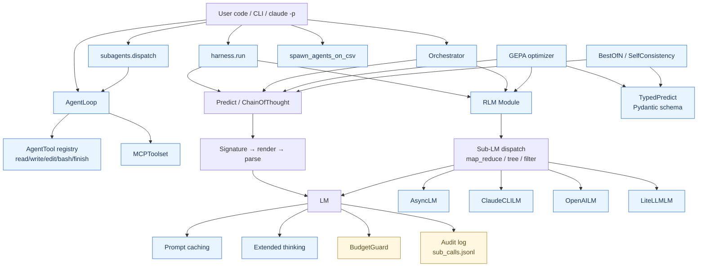
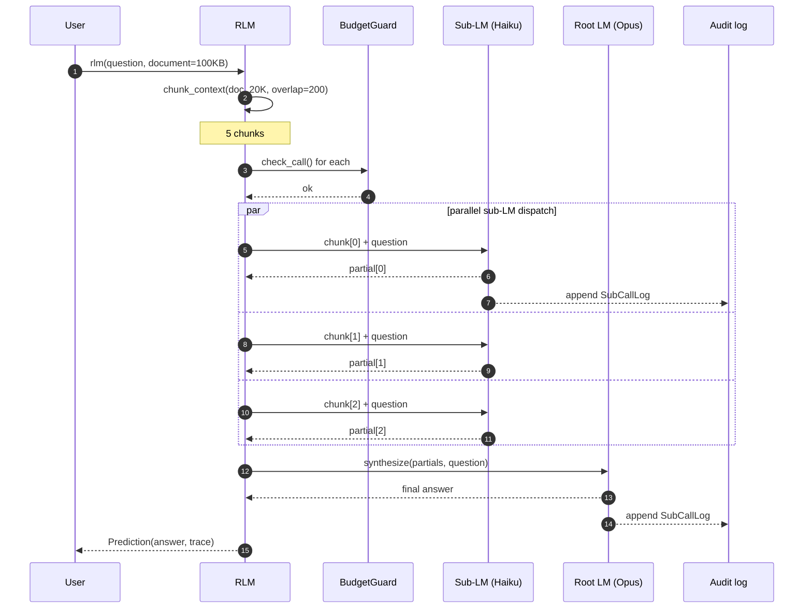
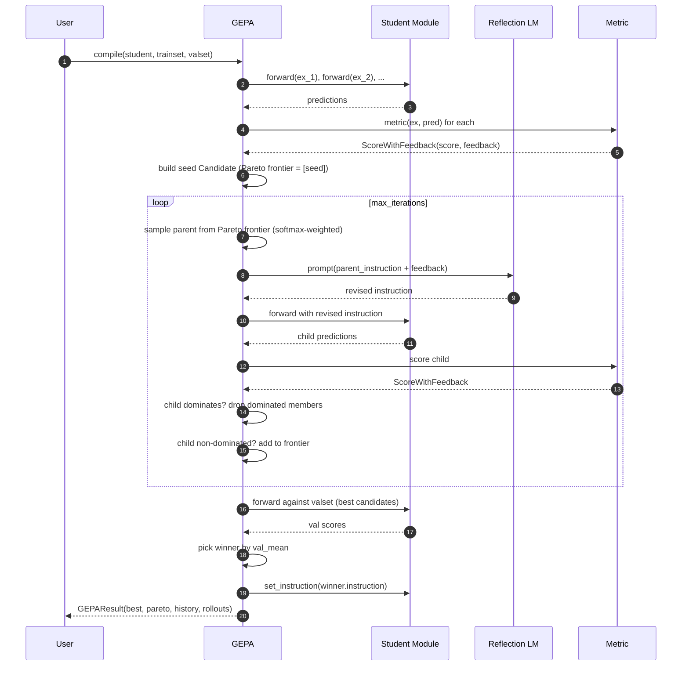
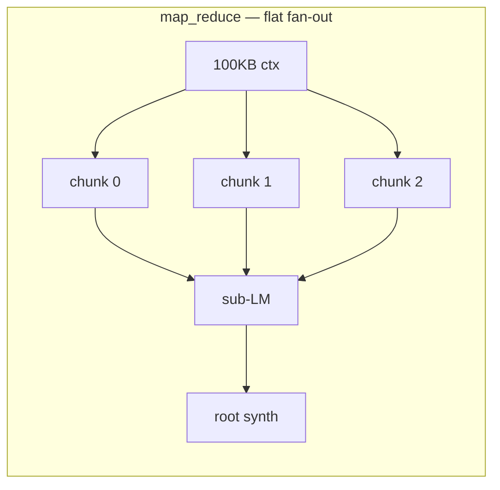
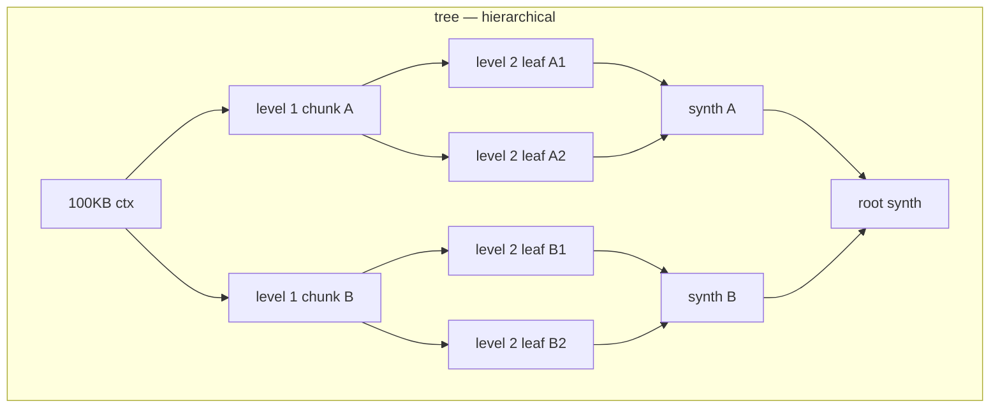
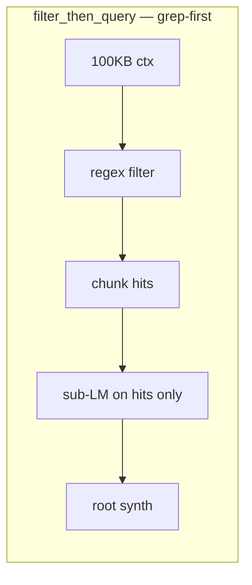

# Architecture

A composable harness for building LLM applications. Designed around three observations:

1. **Long context is a programming problem, not a model problem.** Wrapping a flat LLM in a recursive decomposition loop with a cheap sub-LLM beats raw long-context models on 6–11M token inputs ([Zhang et al., 2025](https://arxiv.org/abs/2512.24601)).
2. **Prompts are programs.** Typed I/O contracts beat string templates; the optimizer's job is to evolve the prompt as a first-class artifact ([GEPA, Agrawal et al., 2025](https://arxiv.org/abs/2507.19457)).
3. **Tool-using agents need 4 tools, not 40.** Pi's minimalism beats a registry — drop scripts on `$PATH`, let `bash` discover them ([Zechner, 2025](https://mariozechner.at/posts/2025-11-30-pi-coding-agent/)).

## Module map



Three groupings:

- **Core (yellow)**: `core.py`, `models.py`, `trajectory.py` — primitives every other layer uses. Zero deps beyond stdlib + pydantic.
- **DSPy-inspired**: `signatures.py`, `modules.py`, `rlm.py`, `gepa.py` — composable typed callables.
- **SOTA (blue)**: everything else — multi-provider LMs, caching, thinking, ensembles, streaming, MCP-as-client, tool loop, subagents, batch.

## End-to-end execution: RLM



## End-to-end execution: GEPA optimization



## End-to-end execution: AgentLoop with tools

```mermaid
sequenceDiagram
    autonumber
    participant User
    participant Loop as AgentLoop
    participant Hooks
    participant LM as Anthropic LM
    participant Tool

    User->>Loop: run("Find the bug in main.py")
    Loop->>Hooks: get_steering_messages()?
    Hooks-->>Loop: []
    Loop->>Hooks: transform_context(msgs)?
    Hooks-->>Loop: msgs (or compressed)
    Loop->>LM: messages.create(system, messages, tools)
    LM-->>Loop: Message(text + tool_use blocks)
    Loop->>Hooks: before_tool_call(name, args)?
    Hooks-->>Loop: false (allowed)
    Loop->>Tool: execute(args)
    Tool-->>Loop: ToolResult(content, details, terminate)
    Loop->>Hooks: after_tool_call(name, args, result)?
    Hooks-->>Loop: result
    Note over Loop: if terminate → break outer
    Loop->>Hooks: should_stop_after_turn(ctx)?
    Hooks-->>Loop: false
    Loop->>Hooks: prepare_next_turn(ctx)?
    Hooks-->>Loop: {"model": "claude-sonnet-4-6"}
    Note over Loop: model swapped mid-run
    Loop->>LM: messages.create with new model
    LM-->>Loop: final text (no tool_use)
    Loop->>Hooks: get_follow_up_messages()?
    Hooks-->>Loop: []
    Loop-->>User: AgentLoopResult(final_text, turns, cost_usd, events)
```

## Decomposition strategies

`RLM` ships three first-class strategies:







| Strategy | When to use | Cost vs flat | Accuracy lift |
|---|---|---|---|
| `map_reduce` | Uniform doc, no structure | ~Nx (N chunks) | Up to 90%+ on >100K ctx |
| `tree` | Hierarchical doc (books, code) | ~N log N | Better aggregation, more synth tokens |
| `filter_then_query` | Sparse signal (logs, transcripts) | Much less than flat | High when grep pattern is good |

## Cost model

Per-call cost is computed from the model's pricing table:

```
cost_usd = (input_tokens × $/M_input + output_tokens × $/M_output) / 1_000_000
```

Pricing tables live in `llm.py` (Anthropic) and `providers.py` (OpenAI). Unknown models fall back to the cheapest rate (Haiku / gpt-5-mini).

For multi-stage runs:

```
total_cost = Σ(stage_cost)
           = Σ(input_tokens × rate_in + output_tokens × rate_out)
```

A typical RLM run with 50K-char context, 3 chunks, Opus root + Haiku sub:
- Sub-LM × 3 calls: 50K chars ÷ 3 ≈ 4K tokens input each, ~200 tokens output each = 3 × (4K × $1 + 200 × $5) / 1M ≈ $0.015
- Root synth × 1 call: ~1K tokens input, ~500 tokens output = (1K × $5 + 500 × $25) / 1M ≈ $0.018
- **Total**: ~$0.033

With prompt caching enabled on the root system block (assuming it's reused 10× in a session):
- First call: 1.25× input rate on the cached portion (write)
- Calls 2–10: 0.1× input rate on the cached portion (hit)
- Net savings: ~80% on the cached fraction (typically 60–80% of root input)

## Trajectory & audit

Every LM call appends one JSON line to `/tmp/rlm/sub_calls.jsonl`:

```json
{
  "timestamp": "2026-05-17T12:51:14Z",
  "prompt_preview": "Answer using ONLY the chunk below...",
  "response_chars": 142,
  "model": "claude-haiku-4-5-20251001",
  "cost_usd": 0.0012
}
```

`Trace` (in-memory, per-call) carries the same data plus latency. `Orchestrator` rolls Trace across steps; `SessionStore` persists the rolled trace to `/tmp/rlm/{session}/events.jsonl`.

## Module size guide

| Module | LOC | Purpose | Read me if you want to |
|---|---|---|---|
| `core.py` | 286 | BudgetGuard, chunker, ingest, skill loader | Understand budget enforcement |
| `signatures.py` | 234 | Typed I/O + prompt rendering + parsing | Extend the prompt format |
| `modules.py` | 230 | Module base, Predict, ChainOfThought, Retry | Build new modules |
| `llm.py` | 280 | Anthropic LM + caching + thinking | Wire a new caching strategy |
| `rlm.py` | 380 | RLM with 3 strategies | Add a 4th decomposition strategy |
| `gepa.py` | 240 | Pareto-frontier reflective optimizer | Tune the mutation prompt |
| `harness.py` | 220 | Pi-style run() + CLI | Add CLI flags |
| `orchestrator.py` | 270 | Multi-step composition + compaction | Build pipelines |
| `tools.py` | 290 | AgentTool + 4-tool core | Add a custom tool |
| `agent_loop.py` | 320 | Tool-using loop with 5 hooks | Plug in policy gates |
| `subagents.py` | 240 | Declarative TOML subagents | Define a custom agent role |
| `batch.py` | 220 | CSV-driven batch dispatch | Run evals |
| `mcp_client.py` | 200 | Wrap external MCP servers | Use community MCP tools |
| `caching.py` | 92 | Anthropic prompt caching helpers | Add cache breakpoints |
| `structured.py` | 175 | Pydantic-typed outputs | Get type-safe responses |
| `providers.py` | 240 | OpenAI + LiteLLM providers | Add a new provider |
| `ensemble.py` | 195 | BestOfN + SelfConsistency | Aggregate multiple samples |
| `streaming.py` | 235 | Sync stream() + AsyncLM | Build a streaming UI |
| `trace_viz.py` | 130 | Pretty-print + Mermaid | Visualize an execution |

Total: ~4.5K LOC of production code + ~3K LOC of tests (232 tests).
